# NBA Assessment System - Database Schema v10.0

## ERD Diagram

```mermaid
erDiagram
    schools ||--o{ departments : "contains"
    schools ||--o{ dean_assignments : "governed_by"
    departments ||--o{ users : "employs"
    departments ||--o{ hod_assignments : "led_by"
    departments ||--o{ courses : "offers"
    departments ||--o{ programmes : "runs"
    users ||--o{ hod_assignments : "serves_as_hod"
    users ||--o{ dean_assignments : "serves_as_dean"
    users ||--o{ course_faculty_assignments : "assigned_to"
    users ||--o{ user_phones : "has_phone"
    users ||--o{ action_plans : "created_by"
    users ||--o{ programme_batches : "coordinates"
    courses ||--o{ course_offerings : "has_sessions"
    courses ||--o{ programme_courses : "part_of_programme"
    programmes ||--o{ programme_courses : "includes_courses"
    programmes ||--o{ programme_batches : "has_batches"
    programmes ||--o{ programme_batch_attainments : "batch_scores"
    programmes ||--o{ stakeholder_surveys : "stakeholder_feedback"
    programme_batches ||--o{ students : "enrolls"
    programme_batches ||--o{ course_offerings : "linked_to"
    programme_batches ||--o{ programme_batch_attainments : "scored_in"
    programme_batches ||--o{ action_plans : "batch_actions"
    programme_batches ||--o{ stakeholder_surveys : "linked_to"
    course_offerings ||--o{ enrollments : "has_students"
    course_offerings ||--o{ course_faculty_assignments : "assigned_faculty"
    course_offerings ||--o{ tests : "assesses_via"
    course_offerings ||--o{ attainment_scale : "configures"
    course_offerings ||--o{ co_po_mapping : "defines_mapping"
    course_offerings ||--o{ offering_co_attainment : "snapshots_co"
    course_offerings ||--o{ offering_po_attainment : "snapshots_po"
    course_offerings ||--o{ course_surveys : "has_survey"
    course_offerings ||--o{ action_plans : "improvement_actions"
    course_surveys ||--o{ course_survey_questions : "contains"
    course_surveys ||--o{ course_survey_responses : "records"
    course_survey_questions ||--o{ course_survey_responses : "answered_in"
    stakeholder_surveys ||--o{ stakeholder_survey_questions : "contains"
    stakeholder_surveys ||--o{ stakeholder_survey_responses : "records"
    stakeholder_survey_questions ||--o{ stakeholder_survey_responses : "answered_in"
    tests ||--o{ questions : "contains"
    tests ||--o{ marks : "aggregates"
    questions ||--o{ raw_marks : "graded_in"
    students ||--o{ enrollments : "enrolls_in"
    students ||--o{ raw_marks : "receives"
    students ||--o{ marks : "has"
    students ||--o{ course_survey_responses : "submits"

    schools {
        int school_id PK
        string school_code UK
        string school_name UK
        text description
        timestamp created_at
    }

    departments {
        int department_id PK
        int school_id FK
        string department_code UK
        string department_name UK
        text description
        timestamp created_at
    }

    users {
        int employee_id PK
        string email UK
        string password_hash
        string username
        enum role "admin, faculty, hod, dean, staff"
        int department_id FK
        int school_id FK
        string designation
        timestamp created_at
        timestamp updated_at
    }

    user_phones {
        bigint id PK
        int employee_id FK
        string phone_number
        timestamp created_at
    }

    hod_assignments {
        bigint id PK
        int department_id FK
        int employee_id FK
        date start_date
        date end_date "NULL=current"
        string appointment_order
        timestamp created_at
    }

    dean_assignments {
        bigint id PK
        int school_id FK
        int employee_id FK
        date start_date
        date end_date "NULL=current"
        string appointment_order
        timestamp created_at
    }

    programmes {
        int programme_id PK
        int department_id FK
        string programme_code UK
        string programme_name UK
        enum degree_level "UG, PG, Diploma, PhD"
        tinyint duration_years
        decimal direct_weightage "default 80"
        decimal indirect_weightage "default 20"
        timestamp created_at
    }

    programme_courses {
        bigint id PK
        int programme_id FK
        bigint course_id FK
        timestamp created_at
    }

    programme_batches {
        int batch_id PK
        int programme_id FK
        int batch_year
        int coordinator_id FK "nullable"
        enum status "upcoming, active, completed"
        date start_date
        date end_date
        timestamp created_at
        timestamp updated_at
    }

    students {
        string roll_no PK
        string student_name
        int programme_id FK
        int batch_id FK "nullable"
        int batch_year "nullable"
        enum student_status "Active, Graduated, Dropped"
        string email
        string phone
    }

    courses {
        bigint course_id PK
        string course_code UK
        int department_id FK
        string course_name
        enum course_type "Theory, Lab, Project, Seminar"
        enum course_level "Undergraduate, Postgraduate, UG & PG"
        bool is_active
        smallint credit
        timestamp created_at
        timestamp updated_at
    }

    course_offerings {
        bigint offering_id PK
        bigint course_id FK
        int programme_batch_id FK "nullable"
        int year
        enum semester "Spring, Autumn"
        decimal co_threshold
        decimal passing_threshold
        decimal direct_weightage "default 80"
        decimal indirect_weightage "default 20"
        blob syllabus_pdf
        timestamp created_at
        timestamp updated_at
    }

    course_faculty_assignments {
        bigint id PK
        bigint offering_id FK
        int employee_id FK
        enum assignment_type "Primary, Co-instructor, Lab"
        date assigned_date
        date completion_date
        bool is_active
        timestamp created_at
    }

    attainment_scale {
        bigint id PK
        bigint offering_id FK
        smallint level
        decimal min_percentage
    }

    co_po_mapping {
        bigint id PK
        bigint offering_id FK
        tinyint co_number "1-6"
        string po_name "PO1-PO12, PSO1-PSO3"
        tinyint value "0-3"
    }

    tests {
        bigint test_id PK
        bigint offering_id FK
        string test_name
        enum test_type "Mid Sem, End Sem, Assignment, Quiz"
        date test_date
        decimal weightage
        int full_marks
        int pass_marks
        blob question_paper_pdf
    }

    questions {
        bigint question_id PK
        bigint test_id FK
        smallint question_number
        string sub_question "nullable"
        bool is_optional
        smallint co "1-6"
        decimal max_marks
    }

    enrollments {
        bigint enrollment_id PK
        bigint offering_id FK
        enum enrollment_status "Enrolled, Dropped, Completed"
        date enrolled_date
        string student_rollno FK
        timestamp enrolled_at
    }

    raw_marks {
        bigint id PK
        string student_id FK
        bigint question_id FK
        decimal marks_obtained
    }

    marks {
        bigint id PK
        string student_roll_no FK
        bigint test_id FK
        tinyint co_number "1-6"
        decimal marks_obtained
    }

    offering_co_attainment {
        bigint offering_id PK, FK
        tinyint co_number PK "1-6"
        decimal attainment_percentage
        decimal attainment_level
        decimal indirect_attainment_percentage
        decimal indirect_attainment_level
        decimal final_attainment_percentage
        decimal final_attainment_level
        timestamp calculated_at
    }

    offering_po_attainment {
        bigint offering_id PK, FK
        string po_name PK
        decimal attainment_value
        decimal indirect_attainment_value
        decimal final_attainment_value
        timestamp calculated_at
    }

    course_surveys {
        bigint survey_id PK
        bigint offering_id FK
        string title
        timestamp created_at
    }

    course_survey_questions {
        bigint question_id PK
        bigint survey_id FK
        smallint question_number
        text question_text
        tinyint co_number "1-6"
        decimal mapping_weight "0.00-1.00"
    }

    course_survey_responses {
        bigint id PK
        bigint survey_id FK
        string student_rollno FK
        bigint question_id FK
        tinyint likert_rating "1-5"
        timestamp imported_at
    }

    stakeholder_surveys {
        bigint survey_id PK
        int programme_id FK
        int batch_id FK "nullable"
        int batch_year
        enum stakeholder_type "Alumni, Employer, Graduate Exit, Parent, Academic Peer"
        string title
        timestamp created_at
    }

    stakeholder_survey_questions {
        bigint question_id PK
        bigint survey_id FK
        smallint question_number
        text question_text
        string po_name
        decimal mapping_weight "0.00-1.00"
    }

    stakeholder_survey_responses {
        bigint survey_id PK, FK
        string respondent_identifier PK
        string respondent_name
        string qualification
        bigint question_id PK, FK
        tinyint likert_rating "1-5"
    }

    programme_batch_attainments {
        bigint id PK
        int programme_id FK
        int batch_id FK "nullable"
        int batch_year
        string po_name
        decimal direct_attainment
        decimal indirect_attainment
        decimal final_attainment
        decimal target
        timestamp calculated_at
    }

    action_plans {
        bigint id PK
        bigint offering_id FK "nullable"
        int programme_id FK "nullable"
        int batch_id FK "nullable"
        int batch_year "nullable"
        string po_name "nullable"
        text gap_description
        text action_text
        string responsible_person
        date target_date
        enum status "Open, In Progress, Completed"
        int created_by FK "nullable"
        timestamp created_at
        timestamp updated_at
    }

    audit_logs {
        bigint id PK
        int user_id FK "nullable"
        enum action "CREATE, UPDATE, DELETE, LOGIN"
        string entity_type
        string entity_id
        json old_values
        json new_values
        string ip_address
        timestamp created_at
    }

    password_resets {
        int id PK
        string email
        string token
        timestamp created_at
        datetime expires_at
    }

    system_settings {
        string setting_key PK
        text setting_value
        timestamp updated_at
    }
```

---

## Table Definitions

### 1. schools

Top-level organizational unit grouping departments.

| Column      | Type         | Constraints                 | Description                               |
| ----------- | ------------ | --------------------------- | ----------------------------------------- |
| school_id   | INT(11)      | PRIMARY KEY, AUTO_INCREMENT | Unique identifier                         |
| school_code | VARCHAR(10)  | UNIQUE, NOT NULL            | Short code (e.g., "SoE")                  |
| school_name | VARCHAR(150) | UNIQUE, NOT NULL            | Full name (e.g., "School of Engineering") |
| description | TEXT         | NULL                        | Additional description                    |
| created_at  | TIMESTAMP    | DEFAULT CURRENT_TIMESTAMP   | Record creation timestamp                 |

**Indexes**: PRIMARY KEY (school_id), UNIQUE KEY (school_code), UNIQUE KEY (school_name)

---

### 2. departments

Academic departments within schools.

| Column          | Type         | Constraints                      | Description                          |
| --------------- | ------------ | -------------------------------- | ------------------------------------ |
| department_id   | INT(11)      | PRIMARY KEY, AUTO_INCREMENT      | Unique identifier                    |
| school_id       | INT(11)      | FOREIGN KEY → schools(school_id) | Parent school                        |
| department_code | VARCHAR(10)  | UNIQUE, NOT NULL                 | Short code (e.g., "CSE", "ECE")      |
| department_name | VARCHAR(100) | UNIQUE, NOT NULL                 | Full name (e.g., "Computer Science") |
| description     | TEXT         | NULL                             | Additional description               |
| created_at      | TIMESTAMP    | DEFAULT CURRENT_TIMESTAMP        | Record creation timestamp            |

**Indexes**: PRIMARY KEY (department_id), UNIQUE KEY (department_name), UNIQUE KEY (department_code), INDEX (school_id)
**Foreign Keys**: school_id REFERENCES schools(school_id) ON DELETE RESTRICT

---

### 3. users

System users with JWT authentication.
**Note**: HOD and Dean roles are managed via `hod_assignments` and `dean_assignments` tables, not the role field alone.

| Column        | Type         | Constraints                              | Description                            |
| ------------- | ------------ | ---------------------------------------- | -------------------------------------- |
| employee_id   | INT(11)      | PRIMARY KEY                              | Unique identifier                      |
| username      | VARCHAR(64)  | NOT NULL                                 | Full name                              |
| email         | VARCHAR(64)  | UNIQUE, NOT NULL                         | Login email                            |
| password_hash | VARCHAR(255) | NOT NULL                                 | Bcrypt hashed password                 |
| role          | ENUM         | 'admin', 'faculty', 'hod', 'dean', 'staff' | Authorization level                  |
| department_id | INT(11)      | FOREIGN KEY → departments(department_id) | Department assignment (NULL for admin) |
| school_id     | INT(11)      | FOREIGN KEY → schools(school_id)         | School assignment (NULL for non-dean)  |
| designation   | VARCHAR(50)  | NULL                                     | Job title (e.g., "Professor")          |
| created_at    | TIMESTAMP    | DEFAULT CURRENT_TIMESTAMP                | Record creation timestamp              |
| updated_at    | TIMESTAMP    | ON UPDATE CURRENT_TIMESTAMP              | Last update timestamp                  |

**Indexes**: PRIMARY KEY (employee_id), UNIQUE KEY (email), INDEX (department_id), INDEX (school_id)
**Foreign Keys**: department_id REFERENCES departments(department_id) ON DELETE SET NULL, school_id REFERENCES schools(school_id) ON DELETE SET NULL

---

### 4. user_phones

Normalized multi-phone storage for users.

| Column       | Type       | Constraints                              | Description                  |
| ------------ | ---------- | ---------------------------------------- | ---------------------------- |
| id           | BIGINT     | PRIMARY KEY, AUTO_INCREMENT              | Unique identifier            |
| employee_id  | INT(11)    | FOREIGN KEY → users(employee_id)         | User owning the phone        |
| phone_number | VARCHAR(15)| NOT NULL                                 | Phone number                 |
| created_at   | TIMESTAMP  | DEFAULT CURRENT_TIMESTAMP                | Record creation timestamp    |

**Indexes**: PRIMARY KEY (id), UNIQUE KEY (employee_id, phone_number), INDEX (employee_id)
**Foreign Keys**: employee_id REFERENCES users(employee_id) ON DELETE CASCADE

---

### 5. hod_assignments

Historical tracking of Head of Department appointments. Current HOD is derived from `end_date IS NULL`.

| Column            | Type        | Constraints                              | Description                         |
| ----------------- | ----------- | ---------------------------------------- | ----------------------------------- |
| id                | BIGINT      | PRIMARY KEY, AUTO_INCREMENT              | Unique identifier                   |
| department_id     | INT(11)     | FOREIGN KEY → departments(department_id) | Department being led                |
| employee_id       | INT(11)     | FOREIGN KEY → users(employee_id)         | Faculty member serving as HOD       |
| start_date        | DATE        | NOT NULL                                 | Appointment start date              |
| end_date          | DATE        | NULL                                     | Appointment end date (NULL=current) |
| appointment_order | VARCHAR(50) | NULL                                     | Official appointment order number   |
| created_at        | TIMESTAMP   | DEFAULT CURRENT_TIMESTAMP                | Record creation timestamp           |

**Indexes**: PRIMARY KEY (id), UNIQUE KEY (department_id, employee_id, start_date), INDEX (department_id, end_date), INDEX (employee_id), INDEX (start_date, end_date)
**Foreign Keys**: department_id REFERENCES departments(department_id) ON DELETE CASCADE, employee_id REFERENCES users(employee_id) ON DELETE RESTRICT

**Purpose**: Query `end_date IS NULL` to get current HOD.

---

### 6. dean_assignments

Historical tracking of Dean appointments. Current Dean is derived from `end_date IS NULL`.

| Column            | Type        | Constraints                      | Description                         |
| ----------------- | ----------- | -------------------------------- | ----------------------------------- |
| id                | BIGINT      | PRIMARY KEY, AUTO_INCREMENT      | Unique identifier                   |
| school_id         | INT(11)     | FOREIGN KEY → schools(school_id) | School being governed               |
| employee_id       | INT(11)     | FOREIGN KEY → users(employee_id) | Faculty/staff serving as Dean       |
| start_date        | DATE        | NOT NULL                         | Appointment start date              |
| end_date          | DATE        | NULL                             | Appointment end date (NULL=current) |
| appointment_order | VARCHAR(50) | NULL                             | Official appointment order number   |
| created_at        | TIMESTAMP   | DEFAULT CURRENT_TIMESTAMP        | Record creation timestamp           |

**Indexes**: PRIMARY KEY (id), UNIQUE KEY (school_id, employee_id, start_date), INDEX (school_id, end_date), INDEX (employee_id), INDEX (start_date, end_date)
**Foreign Keys**: school_id REFERENCES schools(school_id) ON DELETE CASCADE, employee_id REFERENCES users(employee_id) ON DELETE RESTRICT

---

### 7. programmes

Academic programmes offered by departments.

| Column              | Type         | Constraints                              | Description                           |
| ------------------- | ------------ | ---------------------------------------- | ------------------------------------- |
| programme_id        | INT(11)      | PRIMARY KEY, AUTO_INCREMENT              | Unique identifier                     |
| department_id       | INT(11)      | FOREIGN KEY → departments(department_id) | Owning department                     |
| programme_code      | VARCHAR(20)  | UNIQUE, NOT NULL                         | Short code (e.g., "CSE-BTECH")        |
| programme_name      | VARCHAR(150) | UNIQUE, NOT NULL                         | Full name                             |
| degree_level        | ENUM         | 'UG', 'PG', 'Diploma', 'PhD'            | Degree level (default: UG)           |
| duration_years      | TINYINT      | NOT NULL DEFAULT 4                       | Duration in years                     |
| direct_weightage    | DECIMAL(5,2) | DEFAULT 80.00, CHECK (0-100)            | Weight for direct PO attainment        |
| indirect_weightage  | DECIMAL(5,2) | DEFAULT 20.00, CHECK (0-100)            | Weight for indirect PO attainment      |
| created_at          | TIMESTAMP    | DEFAULT CURRENT_TIMESTAMP                | Record creation timestamp             |

**Indexes**: PRIMARY KEY (programme_id), UNIQUE KEY (programme_code), UNIQUE KEY (programme_name), INDEX (department_id)
**Foreign Keys**: department_id REFERENCES departments(department_id) ON DELETE RESTRICT

---

### 8. programme_courses

Many-to-many junction linking programmes to courses.

| Column        | Type       | Constraints                              | Description                     |
| ------------- | ---------- | ---------------------------------------- | ------------------------------- |
| id            | BIGINT     | PRIMARY KEY, AUTO_INCREMENT              | Unique identifier               |
| programme_id  | INT(11)    | FOREIGN KEY → programmes(programme_id)   | Programme                       |
| course_id     | BIGINT     | FOREIGN KEY → courses(course_id)         | Course template                 |
| created_at    | TIMESTAMP  | DEFAULT CURRENT_TIMESTAMP                | Record creation timestamp       |

**Indexes**: PRIMARY KEY (id), UNIQUE KEY (programme_id, course_id), INDEX (programme_id), INDEX (course_id)
**Foreign Keys**: programme_id REFERENCES programmes(programme_id) ON DELETE CASCADE, course_id REFERENCES courses(course_id) ON DELETE CASCADE

---

### 9. programme_batches

Batch-year groups within a programme, used to group offerings and students.

| Column          | Type       | Constraints                              | Description                           |
| --------------- | ---------- | ---------------------------------------- | ------------------------------------- |
| batch_id        | INT        | PRIMARY KEY, AUTO_INCREMENT              | Unique identifier                     |
| programme_id    | INT(11)    | FOREIGN KEY → programmes(programme_id)   | Parent programme                      |
| batch_year      | INT        | NOT NULL                                 | Admission year                        |
| coordinator_id  | INT(11)    | FOREIGN KEY → users(employee_id) NULL    | Batch coordinator                     |
| status          | ENUM       | 'upcoming', 'active', 'completed'        | Current status                        |
| start_date      | DATE       | NULL                                     | Batch start date                      |
| end_date        | DATE       | NULL                                     | Batch end date                        |
| created_at      | TIMESTAMP  | DEFAULT CURRENT_TIMESTAMP                | Record creation timestamp             |
| updated_at      | TIMESTAMP  | ON UPDATE CURRENT_TIMESTAMP              | Last update timestamp                 |

**Indexes**: PRIMARY KEY (batch_id), UNIQUE KEY (programme_id, batch_year), INDEX (programme_id), INDEX (coordinator_id)
**Foreign Keys**: programme_id REFERENCES programmes(programme_id) ON DELETE CASCADE, coordinator_id REFERENCES users(employee_id) ON DELETE SET NULL

---

### 10. students

Student information with roll numbers.

| Column         | Type         | Constraints                              | Description                      |
| -------------- | ------------ | ---------------------------------------- | -------------------------------- |
| roll_no        | VARCHAR(20)  | PRIMARY KEY                              | Student roll number              |
| student_name   | VARCHAR(100) | NOT NULL                                 | Full name                        |
| programme_id   | INT(11)      | FOREIGN KEY → programmes(programme_id)   | Programme                        |
| batch_year     | INT          | NULL                                     | Year of admission (e.g., 2024)   |
| student_status | ENUM         | 'Active', 'Graduated', 'Dropped'         | Current status (default: Active) |
| email          | VARCHAR(100) | NULL                                     | Student email                    |
| phone          | VARCHAR(15)  | NULL                                     | Contact phone number             |

**Indexes**: PRIMARY KEY (roll_no), INDEX (programme_id)
**Foreign Keys**: programme_id REFERENCES programmes(programme_id) ON DELETE CASCADE

---

### 11. courses

Academic course templates (metadata only — no session-specific data).

| Column          | Type         | Constraints                              | Description                        |
| --------------- | ------------ | ---------------------------------------- | ---------------------------------- |
| course_id       | BIGINT       | PRIMARY KEY, AUTO_INCREMENT              | Unique identifier                  |
| course_code     | VARCHAR(20)  | UNIQUE, NOT NULL                         | Course code (e.g., "CS101")        |
| department_id   | INT(11)      | FOREIGN KEY → departments(department_id) | Owning department                  |
| course_name     | VARCHAR(255) | NOT NULL                                 | Full course name                   |
| course_type     | ENUM         | 'Theory', 'Lab', 'Project', 'Seminar'    | Type of course (default: Theory)   |
| course_level    | ENUM         | 'Undergraduate', 'Postgraduate', 'UG & PG' | Level (default: Undergraduate)   |
| is_active       | TINYINT(1)   | DEFAULT 1                                | Whether course is currently active |
| credit          | SMALLINT     | NOT NULL, DEFAULT 0                      | Credit hours                       |
| created_at      | TIMESTAMP    | DEFAULT CURRENT_TIMESTAMP                | Record creation timestamp          |
| updated_at      | TIMESTAMP    | ON UPDATE CURRENT_TIMESTAMP              | Last update timestamp              |

**Indexes**: PRIMARY KEY (course_id), UNIQUE KEY (course_code), INDEX (department_id)
**Foreign Keys**: department_id REFERENCES departments(department_id) ON DELETE RESTRICT

---

### 12. course_offerings

Session-specific instances of a course (Year/Semester).

| Column              | Type         | Constraints                              | Description                           |
| ------------------- | ------------ | ---------------------------------------- | ------------------------------------- |
| offering_id         | BIGINT       | PRIMARY KEY, AUTO_INCREMENT              | Unique identifier                     |
| course_id           | BIGINT       | FOREIGN KEY → courses(course_id)         | Parent course template                |
| year                | INT          | NOT NULL, CHECK (1000-9999)              | Academic year                         |
| semester            | ENUM         | 'Spring', 'Autumn'                       | Semester                              |
| co_threshold        | DECIMAL(5,2) | DEFAULT 40.00, CHECK (0-100)             | CO passing percentage                 |
| passing_threshold   | DECIMAL(5,2) | DEFAULT 60.00, CHECK (0-100)             | Overall passing percentage            |
| direct_weightage    | DECIMAL(5,2) | DEFAULT 80.00, CHECK (0-100)             | Weight % for direct attainment          |
| indirect_weightage  | DECIMAL(5,2) | DEFAULT 20.00, CHECK (0-100)             | Weight % for indirect attainment        |
| syllabus_pdf        | LONGBLOB     | NULL                                     | Syllabus PDF (binary data)            |
| created_at          | TIMESTAMP    | DEFAULT CURRENT_TIMESTAMP                | Record creation timestamp             |
| updated_at          | TIMESTAMP    | ON UPDATE CURRENT_TIMESTAMP              | Last update timestamp                 |

**Indexes**: PRIMARY KEY (offering_id), UNIQUE KEY (course_id, year, semester), INDEX (year, semester), INDEX (course_id)
**Foreign Keys**: course_id REFERENCES courses(course_id) ON DELETE CASCADE

---

### 13. course_faculty_assignments

Historical tracking of faculty assigned to course offerings.

| Column            | Type       | Constraints                              | Description                            |
| ----------------- | ---------- | ---------------------------------------- | -------------------------------------- |
| id                | BIGINT     | PRIMARY KEY, AUTO_INCREMENT              | Unique identifier                      |
| offering_id       | BIGINT     | FOREIGN KEY → course_offerings           | Course offering ID                     |
| employee_id       | INT(11)    | FOREIGN KEY → users(employee_id)         | Faculty member assigned                |
| assignment_type   | ENUM       | 'Primary', 'Co-instructor', 'Lab'        | Type of assignment (default: Primary)  |
| assigned_date     | DATE       | DEFAULT (CURRENT_DATE)                   | Assignment start date                  |
| completion_date   | DATE       | NULL                                     | Assignment end date                    |
| is_active         | TINYINT(1) | DEFAULT 1                                | Whether assignment is currently active |
| created_at        | TIMESTAMP  | DEFAULT CURRENT_TIMESTAMP                | Record creation timestamp              |

**Indexes**: PRIMARY KEY (id), UNIQUE KEY (offering_id, employee_id, assignment_type), INDEX (offering_id), INDEX (employee_id, is_active)
**Foreign Keys**: offering_id REFERENCES course_offerings(offering_id) ON DELETE CASCADE, employee_id REFERENCES users(employee_id) ON DELETE RESTRICT

---

### 14. attainment_scale

Configurable attainment level thresholds per offering.

| Column         | Type         | Constraints                              | Description                             |
| -------------- | ------------ | ---------------------------------------- | --------------------------------------- |
| id             | BIGINT       | PRIMARY KEY, AUTO_INCREMENT              | Unique identifier                       |
| offering_id    | BIGINT       | FOREIGN KEY → course_offerings           | Course offering                         |
| level          | SMALLINT     | NOT NULL, CHECK (0-10)                   | Attainment level (0=fail, 1-3=standard) |
| min_percentage | DECIMAL(5,2) | NOT NULL, CHECK (0-100)                  | Minimum percentage for this level       |

**Indexes**: PRIMARY KEY (id), UNIQUE KEY (offering_id, level), INDEX (offering_id)
**Foreign Keys**: offering_id REFERENCES course_offerings(offering_id) ON DELETE CASCADE

**Purpose**: Define custom attainment scales per offering (e.g., Level 0: 0%, Level 1: 40%, Level 2: 60%, Level 3: 80%)

---

### 15. co_po_mapping

Mapping between Course Outcomes (COs) and Program Outcomes (POs) per offering.

| Column       | Type       | Constraints                              | Description                         |
| ------------ | ---------- | ---------------------------------------- | ----------------------------------- |
| id           | BIGINT     | PRIMARY KEY, AUTO_INCREMENT              | Unique identifier                   |
| offering_id  | BIGINT     | FOREIGN KEY → course_offerings           | Course offering                     |
| co_number    | TINYINT    | NOT NULL, CHECK (1-6)                    | CO number                           |
| po_name      | VARCHAR(5) | NOT NULL                                 | PO identifier (PO1-PO12, PSO1-PSO3) |
| value        | TINYINT    | NOT NULL DEFAULT 0, CHECK (0-3)          | Correlation (0=None, 1=Low, 3=High) |

**Indexes**: PRIMARY KEY (id), UNIQUE KEY (offering_id, co_number, po_name)
**Foreign Keys**: offering_id REFERENCES course_offerings(offering_id) ON DELETE CASCADE

---

### 16. tests

Assessments conducted within a course offering.

| Column             | Type         | Constraints                              | Description                         |
| ------------------ | ------------ | ---------------------------------------- | ----------------------------------- |
| test_id            | BIGINT       | PRIMARY KEY, AUTO_INCREMENT              | Unique identifier                   |
| offering_id        | BIGINT       | FOREIGN KEY → course_offerings           | Course offering ID                  |
| test_name          | VARCHAR(100) | NOT NULL                                 | Test name (e.g., "Mid Sem")         |
| test_type          | ENUM         | 'Mid Sem', 'End Sem', 'Assignment', 'Quiz' | Type of test                      |
| test_date          | DATE         | NULL                                     | Date of assessment                  |
| weightage          | DECIMAL(5,2) | NULL                                     | Weightage in final assessment       |
| full_marks         | INT          | NOT NULL, CHECK (>0)                     | Total marks                         |
| pass_marks         | INT          | NOT NULL, CHECK (>=0)                    | Passing marks                       |
| question_paper_pdf | LONGBLOB     | NULL                                     | PDF of question paper               |

**Indexes**: PRIMARY KEY (test_id), INDEX (offering_id)
**Foreign Keys**: offering_id REFERENCES course_offerings(offering_id) ON DELETE CASCADE

---

### 17. questions

Questions within a test, mapped to COs.

| Column          | Type         | Constraints                      | Description                         |
| --------------- | ------------ | -------------------------------- | ----------------------------------- |
| question_id     | BIGINT       | PRIMARY KEY, AUTO_INCREMENT      | Unique identifier                   |
| test_id         | BIGINT       | FOREIGN KEY → tests(test_id)     | Parent test                         |
| question_number | SMALLINT     | NOT NULL, CHECK (1-20)           | Question number                     |
| sub_question    | VARCHAR(10)  | NULL                             | Sub-part (e.g., "a", "b")           |
| is_optional     | BOOLEAN      | DEFAULT FALSE                    | Is this question optional?          |
| co              | SMALLINT     | NOT NULL, CHECK (1-6)            | Mapped CO number                    |
| max_marks       | DECIMAL(5,2) | NOT NULL, CHECK (>=0.5)          | Max marks for this question         |

**Indexes**: PRIMARY KEY (question_id), INDEX (test_id), INDEX (test_id, question_number), UNIQUE KEY (test_id, question_number, sub_question)
**Foreign Keys**: test_id REFERENCES tests(test_id) ON DELETE CASCADE

---

### 18. enrollments

Students enrolled in a specific course offering.

| Column            | Type         | Constraints                              | Description                      |
| ----------------- | ------------ | ---------------------------------------- | -------------------------------- |
| enrollment_id     | BIGINT       | PRIMARY KEY, AUTO_INCREMENT              | Unique identifier                |
| offering_id       | BIGINT       | FOREIGN KEY → course_offerings           | Course offering ID               |
| enrollment_status | ENUM         | 'Enrolled', 'Dropped', 'Completed'       | Status (default: Enrolled)       |
| enrolled_date     | DATE         | DEFAULT (CURRENT_DATE)                   | Date of enrollment               |
| student_rollno    | VARCHAR(20)  | FOREIGN KEY → students(roll_no)          | Student roll number              |
| enrolled_at       | TIMESTAMP    | DEFAULT CURRENT_TIMESTAMP                | Record creation timestamp        |
| is_repeater       | TINYINT(1)   | DEFAULT 0                                | Whether enrollment is a repeater |

**Indexes**: PRIMARY KEY (enrollment_id), UNIQUE KEY (offering_id, student_rollno), INDEX (offering_id), INDEX (student_rollno)
**Foreign Keys**: offering_id REFERENCES course_offerings(offering_id) ON DELETE CASCADE, student_rollno REFERENCES students(roll_no) ON DELETE CASCADE

---

### 19. raw_marks

Marks obtained by a student for a specific question.

| Column         | Type         | Constraints                      | Description                         |
| -------------- | ------------ | -------------------------------- | ----------------------------------- |
| id             | BIGINT       | PRIMARY KEY, AUTO_INCREMENT      | Unique identifier                   |
| student_id     | VARCHAR(20)  | FOREIGN KEY → students(roll_no)  | Student roll number                 |
| question_id    | BIGINT       | FOREIGN KEY → questions          | Question answered                   |
| marks_obtained | DECIMAL(5,2) | NOT NULL, CHECK (>=0)            | Marks obtained                      |

**Indexes**: PRIMARY KEY (id), UNIQUE KEY (student_id, question_id), INDEX (question_id), INDEX (student_id)
**Foreign Keys**: student_id REFERENCES students(roll_no) ON DELETE CASCADE, question_id REFERENCES questions(question_id) ON DELETE CASCADE

---

### 20. marks

Aggregated marks per CO for a student in a test. Uses tall format (co_number + marks_obtained) instead of repeating CO1-CO6 columns.

| Column          | Type         | Constraints                              | Description                    |
| --------------- | ------------ | ---------------------------------------- | ------------------------------ |
| id              | BIGINT       | PRIMARY KEY, AUTO_INCREMENT              | Unique identifier              |
| student_roll_no | VARCHAR(20)  | FOREIGN KEY → students(roll_no)          | Student roll number            |
| test_id         | BIGINT       | FOREIGN KEY → tests(test_id)             | Parent test                    |
| co_number       | TINYINT      | NOT NULL, CHECK (1-6)                    | CO number                      |
| marks_obtained  | DECIMAL(6,2) | NOT NULL DEFAULT 0, CHECK (>=0)          | Aggregated marks for this CO   |

**Indexes**: PRIMARY KEY (id), UNIQUE KEY (student_roll_no, test_id, co_number), INDEX (test_id)
**Foreign Keys**: student_roll_no REFERENCES students(roll_no) ON DELETE CASCADE, test_id REFERENCES tests(test_id) ON DELETE CASCADE

---

### 21. offering_co_attainment

Materialised CO attainment snapshot computed when a course offering is concluded/locked. Includes direct, indirect (from course exit surveys), and blended final attainment values.

| Column                        | Type         | Constraints                     | Description                                    |
| ----------------------------- | ------------ | ------------------------------- | ---------------------------------------------- |
| offering_id                   | BIGINT       | PRIMARY KEY, FOREIGN KEY        | Course offering ID                             |
| co_number                     | TINYINT      | PRIMARY KEY, CHECK (1-6)        | CO number (1-6)                                |
| attainment_percentage         | DECIMAL(5,2) | NOT NULL DEFAULT 0.00           | Direct: % of students above CO threshold       |
| attainment_level              | DECIMAL(5,2) | NOT NULL DEFAULT 0.00           | Direct: computed attainment level (0-3 scale)  |
| indirect_attainment_percentage| DECIMAL(5,2) | DEFAULT NULL                    | Indirect: % from course exit survey Likert→%   |
| indirect_attainment_level     | DECIMAL(5,2) | DEFAULT NULL                    | Indirect: attainment level from survey data    |
| final_attainment_percentage   | DECIMAL(5,2) | DEFAULT NULL                    | Blended: direct×weightage + indirect×weightage |
| final_attainment_level        | DECIMAL(5,2) | DEFAULT NULL                    | Blended: attainment level of final %           |
| calculated_at                 | TIMESTAMP    | DEFAULT CURRENT_TIMESTAMP       | When this snapshot was computed                |

**Indexes**: PRIMARY KEY (offering_id, co_number), INDEX (offering_id)
**Foreign Keys**: offering_id REFERENCES course_offerings(offering_id) ON DELETE CASCADE

---

### 22. offering_po_attainment

Materialised PO attainment snapshot derived from CO attainment × CO-PO mapping values.

| Column                    | Type         | Constraints                     | Description                                  |
| ------------------------- | ------------ | ------------------------------- | -------------------------------------------- |
| offering_id               | BIGINT       | PRIMARY KEY, FOREIGN KEY        | Course offering ID                           |
| po_name                   | VARCHAR(5)   | PRIMARY KEY                     | PO identifier (PO1-PO12, PSO1-PSO3)         |
| attainment_value          | DECIMAL(5,2) | NOT NULL DEFAULT 0.00           | PO value from direct CO attainment           |
| indirect_attainment_value | DECIMAL(5,2) | DEFAULT NULL                    | PO value from indirect CO attainment only    |
| final_attainment_value    | DECIMAL(5,2) | DEFAULT NULL                    | PO value from blended (final) CO attainment  |
| calculated_at             | TIMESTAMP    | DEFAULT CURRENT_TIMESTAMP       | When this snapshot was computed              |

**Indexes**: PRIMARY KEY (offering_id, po_name), INDEX (offering_id), INDEX (po_name)
**Foreign Keys**: offering_id REFERENCES course_offerings(offering_id) ON DELETE CASCADE

---

### 23. course_surveys

Course exit survey per offering, with configurable questions mapped to COs.

| Column        | Type         | Constraints                              | Description                            |
| ------------- | ------------ | ---------------------------------------- | -------------------------------------- |
| survey_id     | BIGINT       | PRIMARY KEY, AUTO_INCREMENT              | Unique identifier                      |
| offering_id   | BIGINT       | FOREIGN KEY → course_offerings           | Course offering                        |
| title         | VARCHAR(255) | DEFAULT 'Course Exit Survey'             | Survey title                           |
| created_at    | TIMESTAMP    | DEFAULT CURRENT_TIMESTAMP                | Record creation timestamp              |

**Indexes**: PRIMARY KEY (survey_id), INDEX (offering_id)
**Foreign Keys**: offering_id REFERENCES course_offerings(offering_id) ON DELETE CASCADE

---

### 24. course_survey_questions

Questions within a course survey, mapped to COs with configurable mapping weight.

| Column          | Type         | Constraints                              | Description                      |
| --------------- | ------------ | ---------------------------------------- | -------------------------------- |
| question_id     | BIGINT       | PRIMARY KEY, AUTO_INCREMENT              | Unique identifier                |
| survey_id       | BIGINT       | FOREIGN KEY → course_surveys(survey_id)  | Parent survey                    |
| question_number | SMALLINT     | NOT NULL                                 | Order within survey              |
| question_text   | TEXT         | NOT NULL                                 | Question wording                 |
| co_number       | TINYINT      | NOT NULL, CHECK (1-6)                    | Mapped CO                        |
| mapping_weight  | DECIMAL(3,2) | NOT NULL DEFAULT 1.00, CHECK (0-1)       | Weight for CO aggregation        |

**Indexes**: PRIMARY KEY (question_id), UNIQUE KEY (survey_id, question_number)
**Foreign Keys**: survey_id REFERENCES course_surveys(survey_id) ON DELETE CASCADE

---

### 25. course_survey_responses

Individual Likert-scale (1-5) responses per question from students.

| Column         | Type         | Constraints                              | Description                              |
| -------------- | ------------ | ---------------------------------------- | ---------------------------------------- |
| id             | BIGINT       | PRIMARY KEY, AUTO_INCREMENT              | Unique identifier                        |
| survey_id      | BIGINT       | FOREIGN KEY → course_surveys(survey_id)  | Parent survey                            |
| student_rollno | VARCHAR(20)  | FOREIGN KEY → students(roll_no)          | Student                                  |
| question_id    | BIGINT       | FOREIGN KEY → course_survey_questions    | Question answered                        |
| likert_rating  | TINYINT      | NOT NULL, CHECK (1-5)                    | Rating: 1=Strongly Disagree → 5=Strongly Agree |
| imported_at    | TIMESTAMP    | DEFAULT CURRENT_TIMESTAMP                | When the response was recorded           |

**Indexes**: PRIMARY KEY (id), UNIQUE KEY (survey_id, student_rollno, question_id), INDEX (student_rollno), INDEX (question_id)
**Foreign Keys**: survey_id REFERENCES course_surveys(survey_id) ON DELETE CASCADE, student_rollno REFERENCES students(roll_no) ON DELETE CASCADE, question_id REFERENCES course_survey_questions(question_id) ON DELETE CASCADE

**Purpose**: Likert ratings are converted to percentages via formula: `(avg_rating - 1) / 4 * 100`, then blended with direct attainment using the offering's configured weightage.

---

### 26. stakeholder_surveys

Survey per programme/batch/stakeholder-type, with configurable questions mapped to POs.

| Column           | Type         | Constraints                              | Description                             |
| ---------------- | ------------ | ---------------------------------------- | --------------------------------------- |
| survey_id        | BIGINT       | PRIMARY KEY, AUTO_INCREMENT              | Unique identifier                       |
| programme_id     | INT(11)      | FOREIGN KEY → programmes(programme_id)   | Programme being evaluated               |
| batch_id         | INT(11)      | FOREIGN KEY → programme_batches(batch_id) NULL | Linked batch group                |
| batch_year       | INT          | NOT NULL                                 | Batch year                              |
| stakeholder_type | ENUM         | 'Alumni', 'Employer', 'Graduate Exit', 'Parent', 'Academic Peer' | Type of stakeholder |
| title            | VARCHAR(255) | DEFAULT 'Stakeholder Survey'             | Survey title                            |
| created_at       | TIMESTAMP    | DEFAULT CURRENT_TIMESTAMP                | Record creation timestamp               |

**Indexes**: PRIMARY KEY (survey_id), UNIQUE KEY (programme_id, batch_year, stakeholder_type), INDEX (batch_id)
**Foreign Keys**: programme_id REFERENCES programmes(programme_id) ON DELETE CASCADE, batch_id REFERENCES programme_batches(batch_id) ON DELETE CASCADE

---

### 27. stakeholder_survey_questions

Questions within a stakeholder survey, mapped to POs with configurable mapping weight.

| Column          | Type         | Constraints                              | Description                      |
| --------------- | ------------ | ---------------------------------------- | -------------------------------- |
| question_id     | BIGINT       | PRIMARY KEY, AUTO_INCREMENT              | Unique identifier                |
| survey_id       | BIGINT       | FOREIGN KEY → stakeholder_surveys        | Parent survey                    |
| question_number | SMALLINT     | NOT NULL                                 | Order within survey              |
| question_text   | TEXT         | NOT NULL                                 | Question wording                 |
| po_name         | VARCHAR(5)   | NOT NULL                                 | Mapped PO (PO1-PO12, PSO1-PSO3) |
| mapping_weight  | DECIMAL(3,2) | NOT NULL DEFAULT 1.00, CHECK (0-1)       | Weight for PO aggregation        |

**Indexes**: PRIMARY KEY (question_id), UNIQUE KEY (survey_id, question_number)
**Foreign Keys**: survey_id REFERENCES stakeholder_surveys(survey_id) ON DELETE CASCADE

---

### 28. stakeholder_survey_responses

Individual Likert-scale (1-5) responses per question from external stakeholders.

| Column                | Type         | Constraints                              | Description                              |
| --------------------- | ------------ | ---------------------------------------- | ---------------------------------------- |
| survey_id             | BIGINT       | PRIMARY KEY, FOREIGN KEY                 | Parent survey                            |
| respondent_identifier | VARCHAR(255) | PRIMARY KEY                              | Group identifier linking all ratings from one respondent |
| respondent_name       | VARCHAR(255) | NULL                                     | Respondent display name                  |
| qualification         | VARCHAR(255) | NULL                                     | Respondent qualification / designation   |
| question_id           | BIGINT       | PRIMARY KEY, FOREIGN KEY                 | Question answered                        |
| likert_rating         | TINYINT      | NOT NULL, CHECK (1-5)                    | Rating: 1=Strongly Disagree → 5=Strongly Agree |

**Indexes**: PRIMARY KEY (survey_id, respondent_identifier, question_id), INDEX (survey_id, question_id), INDEX (question_id)
**Foreign Keys**: survey_id REFERENCES stakeholder_surveys(survey_id) ON DELETE CASCADE, question_id REFERENCES stakeholder_survey_questions(question_id) ON DELETE CASCADE

---

### 29. programme_batch_attainments

Final blended PO/PSO scores for a specific programme and batch.

| Column              | Type         | Constraints                                      | Description                              |
| ------------------- | ------------ | ------------------------------------------------ | ---------------------------------------- |
| id                  | BIGINT       | PRIMARY KEY, AUTO_INCREMENT                      | Unique identifier                        |
| programme_id        | INT(11)      | FOREIGN KEY → programmes(programme_id)           | Programme                                |
| batch_id            | INT(11)      | FOREIGN KEY → programme_batches(batch_id) NULL   | Batch group                              |
| batch_year          | INT          | NOT NULL                                         | Batch year                               |
| po_name             | VARCHAR(5)   | NOT NULL                                         | PO identifier (PO1-PO12, PSO1-PSO3)     |
| direct_attainment   | DECIMAL(5,2) | DEFAULT 0.00                                     | Direct PO from aggregated offering snapshots |
| indirect_attainment | DECIMAL(5,2) | DEFAULT 0.00                                     | Indirect PO from stakeholder surveys     |
| final_attainment    | DECIMAL(5,2) | DEFAULT 0.00                                     | Blended: direct×weightage + indirect×weightage |
| target              | DECIMAL(5,2) | DEFAULT 0.00                                     | Target threshold for this PO             |
| calculated_at       | TIMESTAMP    | DEFAULT CURRENT_TIMESTAMP                        | When the calculation was run             |

**Indexes**: PRIMARY KEY (id), UNIQUE KEY (programme_id, batch_year, po_name), INDEX (batch_id)
**Foreign Keys**: programme_id REFERENCES programmes(programme_id) ON DELETE CASCADE, batch_id REFERENCES programme_batches(batch_id) ON DELETE CASCADE

---

### 30. action_plans

Documents continuous improvement actions triggered by attainment gaps.

| Column              | Type         | Constraints                                      | Description                              |
| ------------------- | ------------ | ------------------------------------------------ | ---------------------------------------- |
| id                  | BIGINT       | PRIMARY KEY, AUTO_INCREMENT                      | Unique identifier                        |
| offering_id         | BIGINT       | FOREIGN KEY → course_offerings (NULL)            | Optional link to a specific offering     |
| programme_id        | INT(11)      | FOREIGN KEY → programmes (NULL)                  | Optional link to a programme             |
| batch_id            | INT(11)      | FOREIGN KEY → programme_batches(batch_id) NULL   | Optional link to a batch                 |
| batch_year          | INT          | NULL                                             | Batch year relevant to the gap           |
| po_name             | VARCHAR(5)   | NULL                                             | PO that fell below target                |
| gap_description     | TEXT         | NOT NULL                                         | Description of the gap                   |
| action_text         | TEXT         | NOT NULL                                         | Proposed remediation                     |
| responsible_person  | VARCHAR(255) | NULL                                             | Who is accountable                       |
| target_date         | DATE         | NULL                                             | Expected completion date                 |
| status              | ENUM         | 'Open', 'In Progress', 'Completed'               | Current status (default: Open)           |
| created_by          | INT(11)      | FOREIGN KEY → users(employee_id) (NULL)          | Who created the plan                     |
| created_at          | TIMESTAMP    | DEFAULT CURRENT_TIMESTAMP                        | Record creation timestamp                |
| updated_at          | TIMESTAMP    | ON UPDATE CURRENT_TIMESTAMP                      | Last update timestamp                    |

**Indexes**: PRIMARY KEY (id), INDEX (offering_id), INDEX (programme_id), INDEX (status), INDEX (batch_id)
**Foreign Keys**: offering_id REFERENCES course_offerings(offering_id) ON DELETE CASCADE, programme_id REFERENCES programmes(programme_id) ON DELETE CASCADE, batch_id REFERENCES programme_batches(batch_id) ON DELETE SET NULL, created_by REFERENCES users(employee_id) ON DELETE SET NULL

---

### 31. audit_logs

Tracks all significant data changes and login events for auditing.

| Column      | Type         | Constraints                              | Description                      |
| ----------- | ------------ | ---------------------------------------- | -------------------------------- |
| id          | BIGINT       | PRIMARY KEY, AUTO_INCREMENT              | Unique identifier                |
| user_id     | INT(11)      | FOREIGN KEY → users(employee_id) NULL    | Who performed the action         |
| action      | ENUM         | 'CREATE', 'UPDATE', 'DELETE', 'LOGIN'    | Type of action                   |
| entity_type | VARCHAR(50)  | NOT NULL                                 | Affected table/entity            |
| entity_id   | VARCHAR(50)  | NOT NULL                                 | Affected record ID               |
| old_values  | JSON         | NULL                                     | Previous state (for U/D actions) |
| new_values  | JSON         | NULL                                     | New state (for C/U actions)      |
| ip_address  | VARCHAR(45)  | NULL                                     | Client IP address                |
| created_at  | TIMESTAMP    | DEFAULT CURRENT_TIMESTAMP                | Record creation timestamp        |

**Indexes**: PRIMARY KEY (id), INDEX (entity_type, entity_id), INDEX (user_id), INDEX (action)
**Foreign Keys**: user_id REFERENCES users(employee_id) ON DELETE SET NULL

---

### 32. password_resets

Stores temporary tokens generated for the self-service forgot password / password reset flow.

| Column      | Type        | Constraints                 | Description                      |
| ----------- | ----------- | --------------------------- | -------------------------------- |
| id          | INT(11)     | PRIMARY KEY, AUTO_INCREMENT | Unique identifier                |
| email       | VARCHAR(255)| NOT NULL                    | Email requesting the reset       |
| token       | VARCHAR(255)| NOT NULL                    | Unique, secure reset token       |
| created_at  | TIMESTAMP   | DEFAULT CURRENT_TIMESTAMP   | Token generation timestamp       |
| expires_at  | DATETIME    | NOT NULL                    | Expiration timestamp of the token|

**Indexes**: PRIMARY KEY (id), INDEX (email), INDEX (token)

### 33. system_settings

Stores global key-value configuration settings for the system branding, university names, motto texts and active logo path.

| Column        | Type        | Constraints  | Description                            |
| ------------- | ----------- | ------------ | -------------------------------------- |
| setting_key   | VARCHAR(100)| PRIMARY KEY  | Setting identifier/key                 |
| setting_value | TEXT        | NOT NULL     | Value configured for the setting       |
| updated_at    | TIMESTAMP   | DEFAULT CURRENT_TIMESTAMP ON UPDATE CURRENT_TIMESTAMP | Last update timestamp |

**Indexes**: PRIMARY KEY (setting_key)

---

## Views

### v_current_hods

Returns the currently active HOD per department (where `end_date IS NULL`).

### v_current_deans

Returns the currently active Dean per school (where `end_date IS NULL`).

### v_current_offerings

Returns course offerings joined with course details, department, and primary faculty assignment.
