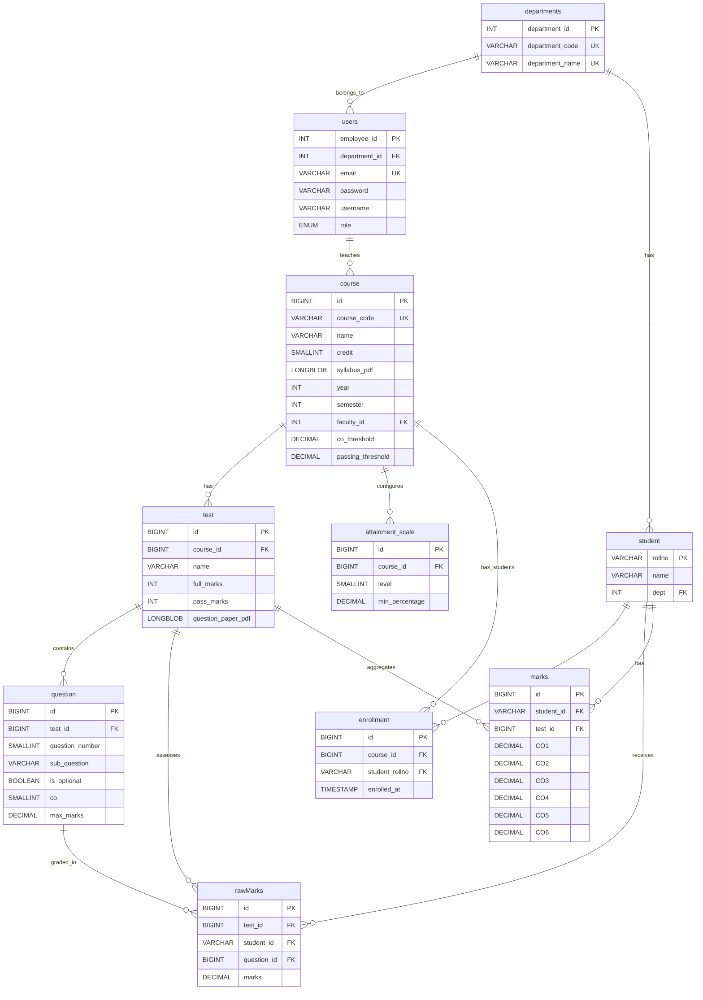

# NBA Assessment System - Entity-Relationship Diagram

## Complete ER Diagram



---

## Relationship Details

### 1. departments ↔ users

-   **Cardinality**: One-to-Many (1:N)
-   **Description**: One department can have multiple users (HOD, faculty, staff)
-   **Foreign Key**: users.department_id → departments.department_id
-   **Delete Behavior**: ON DELETE SET NULL (allows admin users without department)

### 2. departments ↔ student

-   **Cardinality**: One-to-Many (1:N)
-   **Description**: One department has many students
-   **Foreign Key**: student.dept → departments.department_id
-   **Delete Behavior**: ON DELETE RESTRICT (cannot delete department with students)

### 3. users ↔ course

-   **Cardinality**: One-to-Many (1:N)
-   **Description**: One faculty member can teach multiple courses
-   **Foreign Key**: course.faculty_id → users.employee_id
-   **Delete Behavior**: ON DELETE RESTRICT (cannot delete faculty with assigned courses)
-   **Role Filter**: Only users with role 'faculty' or 'hod' can be assigned

### 4. course ↔ test

-   **Cardinality**: One-to-Many (1:N)
-   **Description**: One course can have multiple assessments/tests
-   **Foreign Key**: test.course_id → course.id
-   **Delete Behavior**: ON DELETE CASCADE (deleting course removes all its tests)

### 5. course ↔ attainment_scale

-   **Cardinality**: One-to-Many (1:N)
-   **Description**: One course has multiple attainment level configurations
-   **Foreign Key**: attainment_scale.course_id → course.id
-   **Delete Behavior**: ON DELETE CASCADE
-   **Unique Constraint**: (course_id, level) - Each level defined once per course

### 6. course ↔ enrollment

-   **Cardinality**: One-to-Many (1:N)
-   **Description**: One course has many student enrollments
-   **Foreign Key**: enrollment.course_id → course.id
-   **Delete Behavior**: ON DELETE CASCADE (unenrolls students when course deleted)

### 7. test ↔ question

-   **Cardinality**: One-to-Many (1:N)
-   **Description**: One test contains multiple questions
-   **Foreign Key**: question.test_id → test.id
-   **Delete Behavior**: ON DELETE CASCADE (deleting test removes all questions)
-   **Unique Constraint**: (test_id, question_number, sub_question)

### 8. test ↔ rawMarks

-   **Cardinality**: One-to-Many (1:N)
-   **Description**: One test has many per-question marks entries
-   **Foreign Key**: rawMarks.test_id → test.id
-   **Delete Behavior**: ON DELETE CASCADE

### 9. test ↔ marks

-   **Cardinality**: One-to-Many (1:N)
-   **Description**: One test has many CO-aggregated marks entries
-   **Foreign Key**: marks.test_id → test.id
-   **Delete Behavior**: ON DELETE CASCADE

### 10. student ↔ enrollment

-   **Cardinality**: One-to-Many (1:N)
-   **Description**: One student can enroll in multiple courses
-   **Foreign Key**: enrollment.student_rollno → student.rollno
-   **Delete Behavior**: ON DELETE CASCADE
-   **Unique Constraint**: (course_id, student_rollno) - Prevents duplicate enrollments

### 11. student ↔ rawMarks

-   **Cardinality**: One-to-Many (1:N)
-   **Description**: One student receives marks for multiple questions
-   **Foreign Key**: rawMarks.student_id → student.rollno
-   **Delete Behavior**: ON DELETE CASCADE
-   **Unique Constraint**: (test_id, student_id, question_id)

### 12. student ↔ marks

-   **Cardinality**: One-to-Many (1:N)
-   **Description**: One student has CO marks for multiple tests
-   **Foreign Key**: marks.student_id → student.rollno
-   **Delete Behavior**: ON DELETE CASCADE
-   **Unique Constraint**: (student_id, test_id) - One CO aggregate per test

### 13. question ↔ rawMarks

-   **Cardinality**: One-to-Many (1:N)
-   **Description**: One question is graded for multiple students
-   **Foreign Key**: rawMarks.question_id → question.id
-   **Delete Behavior**: ON DELETE CASCADE (removes all marks when question deleted)

---

## Entity Descriptions

### departments (Academic Departments)

**Purpose**: Organization structure for the institution  
**Primary Key**: department_id  
**Unique Keys**: department_code, department_name  
**Examples**: CSE, ECE, ME, CE

### users (System Users)

**Purpose**: Authentication and role-based access control  
**Primary Key**: employee_id  
**Unique Keys**: email  
**Roles**: admin, dean, hod, faculty, staff  
**Authentication**: JWT with bcrypt password hashing

### course (Academic Courses)

**Purpose**: Course offerings with faculty assignment  
**Primary Key**: id  
**Unique Keys**: course_code  
**Key Features**:

-   Syllabus PDF storage
-   Year/semester tracking
-   Configurable CO and passing thresholds

### attainment_scale (Attainment Configuration)

**Purpose**: Custom attainment level definitions per course  
**Primary Key**: id  
**Unique Keys**: (course_id, level)  
**Key Features**: Flexible scale (0-10 levels with custom percentages)

### test (Assessments)

**Purpose**: Exams and assessments for courses  
**Primary Key**: id  
**Key Features**:

-   Question paper PDF storage
-   Full marks and pass marks definition
-   Multiple tests per course support

### question (Assessment Questions)

**Purpose**: Individual questions with CO mapping  
**Primary Key**: id  
**Unique Keys**: (test_id, question_number, sub_question)  
**Key Features**:

-   Supports main questions and sub-questions (1a, 1b, etc.)
-   Optional question marking
-   CO1-CO6 mapping for NBA compliance

### student (Students)

**Purpose**: Student information  
**Primary Key**: rollno (Student ID serves as primary key)  
**Key Features**: Department-based organization

### enrollment (Course Enrollments)

**Purpose**: Many-to-many relationship between students and courses  
**Primary Key**: id  
**Unique Keys**: (course_id, student_rollno)  
**Key Features**:

-   Timestamp tracking
-   Prevents duplicate enrollments

### rawMarks (Per-Question Marks)

**Purpose**: Granular marks entry at question level  
**Primary Key**: id  
**Unique Keys**: (test_id, student_id, question_id)  
**Key Features**:

-   Detailed marks breakdown
-   Used to calculate CO aggregates
-   Supports 2 decimal precision

### marks (CO-Aggregated Marks)

**Purpose**: NBA-ready Course Outcome marks  
**Primary Key**: id  
**Unique Keys**: (student_id, test_id)  
**Key Features**:

-   Six CO columns (CO1-CO6)
-   Auto-calculated from rawMarks
-   2 decimal precision

---

## Data Flow Patterns

### 1. Course Creation Flow

```
1. Admin/HOD creates department
2. HOD/Admin creates faculty user
3. HOD creates course assigned to faculty
4. Faculty creates assessment (test)
5. Faculty adds questions with CO mapping
```

### 2. Student Enrollment Flow

```
1. Admin creates department
2. Staff creates student record
3. Staff enrolls student in courses
4. Student appears in faculty's course roster
```

### 3. Marks Entry Flow

```
1. Faculty creates test with questions
2. Students are enrolled in course
3. Faculty enters per-question marks (rawMarks)
4. System auto-calculates CO aggregates (marks)
5. CO totals available for attainment calculation
```

### 4. Attainment Calculation Flow

```
1. Faculty configures attainment scale for course
2. Faculty sets CO threshold and passing threshold
3. System calculates attainment from marks table
4. Generate NBA reports based on thresholds
```

---

## Normalization

### Database Normalization: 3rd Normal Form (3NF)

**1NF Compliance:**

-   All tables have primary keys
-   All columns contain atomic values
-   No repeating groups

**2NF Compliance:**

-   All non-key attributes fully depend on primary key
-   No partial dependencies

**3NF Compliance:**

-   No transitive dependencies
-   All non-key attributes depend only on primary key

**Intentional Denormalization:**

-   `marks` table stores 6 CO columns (CO1-CO6) for performance
-   Alternative would be pivot table (mark_id, co_number, marks)
-   Current design optimizes for frequent CO-based queries

---

## Constraints & Business Rules

### Unique Constraints

1. One department code per department
2. One email per user
3. One course code per course
4. One student per enrollment per course
5. One marks entry per question per student
6. One CO aggregate per test per student
7. One attainment level configuration per course

### Check Constraints

1. Year must be 4 digits (1000-9999)
2. CO number must be 1-6
3. Question number must be 1-20
4. Attainment level must be 0-10
5. All marks must be non-negative
6. Thresholds must be 0-100%

### Foreign Key Constraints

All foreign keys maintain referential integrity with appropriate CASCADE, RESTRICT, or SET NULL behaviors

---

## Index Strategy

### Primary Indexes

-   All primary keys automatically indexed

### Foreign Key Indexes

-   All foreign keys automatically indexed by MySQL

### Composite Unique Indexes

-   (course_id, student_rollno) on enrollment
-   (test_id, student_id, question_id) on rawMarks
-   (student_id, test_id) on marks
-   (test_id, question_number, sub_question) on question
-   (course_id, level) on attainment_scale

### Search Optimization Indexes

-   (year, semester) on course - for filtering by academic period
-   (test_id, student_id) on rawMarks - for retrieving student's test marks

---

## Scalability Considerations

### Current Capacity

-   10 tables
-   ~100-1000 users per institution
-   ~500-5000 courses per year
-   ~10,000-100,000 students
-   ~50,000-500,000 marks entries per semester

### Performance Optimizations

1. **Indexes**: All foreign keys and unique constraints indexed
2. **BLOB Storage**: Separate BLOB columns allow selective retrieval
3. **Dual Marks Storage**: rawMarks for entry, marks for reporting
4. **Department Isolation**: Faculty/HOD queries filtered by department

### Future Scaling Options

1. **Partitioning**: Partition marks/rawMarks by year/semester
2. **Archiving**: Move old semester data to archive tables
3. **BLOB Extraction**: Move PDFs to file system with database references
4. **Read Replicas**: For dean/admin read-heavy queries

---

**Database Version**: 2.0  
**Last Updated**: December 27, 2025  
**Diagram Tool**: Mermaid  
**DBMS**: MySQL 8.0+

**See Also**:

-   [DATABASE_SCHEMA.md](DATABASE_SCHEMA.md) - Detailed table definitions
-   [db.sql](db.sql) - Complete schema with sample data
-   [API_REFERENCE.md](API_REFERENCE.md) - API endpoints documentation
